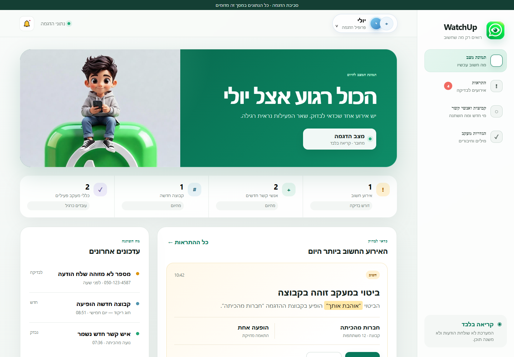
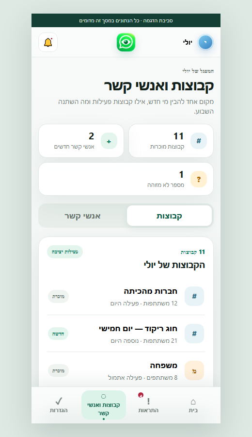
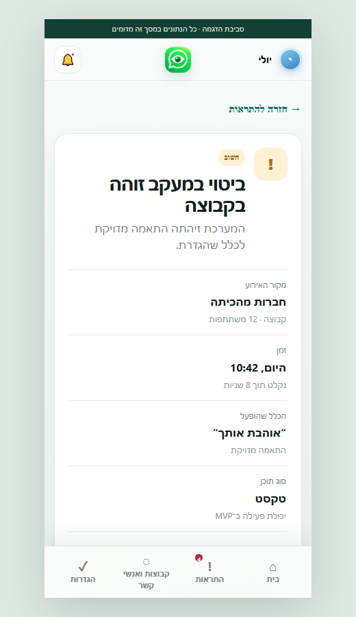

<div dir="rtl" align="right">

# WatchUp 👁️

### רואים את החריגים. שומרים על הילדים. בלי לקרוא הכול.


**גרסת POC:** `0.3.5` · **יוצר:** EG · **עודכן:** 05.10.2026

WatchUp היא אפליקציית פיקוח הורי בעברית, שמציגה להורים תמונת מצב ברורה ועדכנית על אירועים חשובים בחשבון ה־WhatsApp של הילד או הילדה. המערכת מיועדת לזהות חריגים ולהתריע עליהם — לא להפוך את ההורה לקורא קבוע של כל השיחות.

> הפרויקט נמצא בשלב POC למשפחה אחת: אלדד ואשתו, עבור יולי בת 9. כל הנתונים שמופיעים כרגע בממשק הם נתוני הדגמה סינתטיים בלבד.

## הצצה למוצר

| דשבורד הורי | קבוצות ואנשי קשר | פרטי אירוע |
|---|---|---|
|  |  |  |

השפה החזותית והמבנה מבוססים על מסכי **Google Stitch** שאושרו לפרויקט: חוויה רגועה, נעימה וברורה להורים, עם תמיכה מלאה בעברית וב־RTL.

## מה כלול ב־MVP

- דשבורד שמרכז את מצב החיבור, האירועים האחרונים והפעילות החשובה.
- יומן התראות בזמן אמת עם סינון לפי רמת דחיפות.
- זיהוי אנשי קשר חדשים או לא מזוהים.
- זיהוי קבוצות חדשות ושינויים בקבוצות.
- מעקב אחר מילים וביטויים שההורה הגדיר מראש.
- מסך קבוצות ואנשי קשר.
- מסך פרטי אירוע עם הקשר ברור ופעולות צפייה בלבד.
- הגדרות מעקב בסיסיות ודוחות POC.
- התאמה למובייל ולמחשב, RTL ונגישות.

## עיקרון בטיחות מרכזי

החיבור ל־WhatsApp הוא **לקריאה בלבד**. WatchUp אינה שולחת הודעות, אינה מוחקת או עורכת תוכן, אינה מגיבה, אינה מקלידה בשם הילדה ואינה מבצעת פעולות בחשבון שלה.

ניתוח טקסט הוא היכולת הפעילה הראשונה. קול, תמונות ומיקומים נמצאים בתכנון ויופעלו רק לאחר הוכחת תמיכה אמיתית ובטוחה — הם אינם מוצגים כיכולת פעילה בגרסה הנוכחית.

## ארכיטקטורת ה־POC

```text
WhatsApp של הילדה
        │ קריאה בלבד
        ▼
WhatsApp Bridge + MCP
        │ אירועים חתומים
        ▼
WatchUp API ── PostgreSQL מבודד
        │
        ▼
דשבורד הורים בעברית וב־RTL
```

- `whatsapp-mcp/` — מקור מותאם של הגשר וה־MCP, כולל חסימת פעולות יוצאות.
- `watchup-api/` — קליטה מאומתת, מניעת כפילויות, בידוד tenant/child ו־API לקריאה.
- `watchup-web/` — ארבעת מסכי ה־MVP והגדרות המעקב.
- `docs/` וקובצי התכנון — דרישות, אבטחה, ארכיטקטורה ושערי אימות.

## אבטחה ופרטיות

- נתוני ילדים ומשפחה מוגדרים כמידע רגיש במיוחד.
- אין להכניס ל־Git טוקנים, QR sessions, הודעות, מדיה, מסדי נתונים או קובצי `.env` אמיתיים.
- PostgreSQL, ה־API וה־Bridge מיועדים לרוץ ב־VPS ברשתות, משתמשים, סודות ונפחים ייעודיים ל־WatchUp.
- לפני חיבור טלפון אמיתי נדרשים אימות הורה, שער אבטחה סופי, מדיניות מחיקה ושמירה מאומתת ואישור Owner מפורש.
- לפני פיילוט רב־משתמשים נדרשת הפרדה מלאה בין משפחות וילדים.

## הפעלה מקומית עם נתוני הדגמה

אין צורך בחיבור WhatsApp כדי לראות את הממשק:

```powershell
cd watchup-web
python -m http.server 4173
```

לאחר מכן פותחים בדפדפן: `http://127.0.0.1:4173`

## בדיקות

```powershell
python -m unittest discover -s watchup-web/tests -p "test_*.py"
python -m unittest discover -s watchup-api/tests -p "test_*.py"
cd whatsapp-mcp/whatsapp-bridge
go test ./...
```

הבדיקות מכסות בין היתר: חסימת פעולות יוצאות, אימות אירועים, מניעת replay וכפילויות, בידוד מסד נתונים, RTL, נגישות ותצוגה רספונסיבית.

## מצב פריסה

גרסת WP‑3.5 זמינה בסביבת הדגמה מבודדת ב־[VPS של WatchUp](https://watchup.srv1282987.hstgr.cloud/) עם נתונים סינתטיים בלבד. חיבור הטלפון של יולי הוא שלב נפרד: רק לאחר מעבר שער האבטחה ואישור Owner נפרד יתבצע צימוד QR לקריאה בלבד.

## יעד המוצר

להעניק להורים דרך פשוטה, נעימה ואחראית לזהות בזמן אירועים שדורשים תשומת לב — בריונות, חרם, שפה פוגענית, גורם לא מוכר או קבוצה חשודה — תוך שמירה קפדנית על פרטיות, הפרדת נתונים ושקיפות מלאה לגבי מה המערכת יודעת ומה עדיין לא.

## מפת דרך קצרה

1. POC למשפחה אחת וטלפון אחד.
2. אימות יציבות החיבור וההתראות בזמן אמת.
3. הרחבת ניתוח המדיה רק ליכולות שעברו הוכחה.
4. הקשחת אבטחה ופיילוט מצומצם עם הורים נוספים.
5. מוצר רב־משתמשים בתשלום, עם בידוד מלא בין משפחות.

---

**WatchUp by EG** — פיקוח הורי שמתחיל בדאגה, לא בחדירה.

</div>
